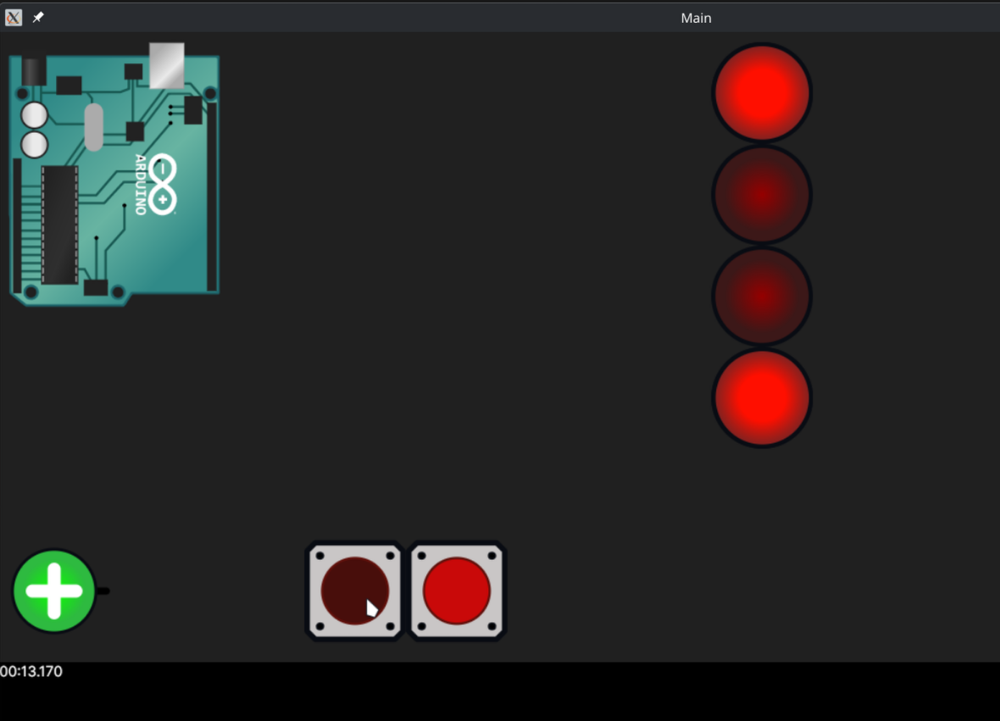

## Prerequisites:  
- Boost (with ASIO)
- arduino-cli
- .NET 9

## Current usage workflow:
  1. Run `preprocess.sh <test dir>`. For example `preprocess.sh tests/buttons`
  2. Build `core/CMakeLists.txt`
  3. Run core as `<build dir>/executable/arguino --single-process`
  4. Build and run gui from the `gui` directory with specified scene. For example `<build dir>/Gui -s ./arduinoScene.yaml`

## Command line arguments:
### Core
- `-p | --port <int>` - Port on which to launch TCP server [= `8888`]
- `--log-simulator <path>` - Path to the log file for simulator events [= `./core.log`]
- `--log-tcp <path>` - Path to the log file for TCP events" [= `./core_tcp.log`]

### Gui
- `-s | --scene <path>` - Path to the .yaml scene defintion [= `./scene.yaml`]
- `-c | --components <path>` - Path to the directory of components definitions [= `./ComponentManager/Components`]
- `-p | --port <int>` - TCP port to listen to. Core is hard-coded to 8888 [= `8888`]
- `--no-tcp` - Skips connection to TCP server at initialization
- `--log-tcp <path>` - Path to the log file for TCP messages [= `./frontend_tcp.log`]
- `--log-circuit <path>` - Path to the log file for general circuitry events [= `./frontend.log`]
 
## Gui controls
- `Mouse wheel scroll` - Zoom and unzoom canvas
- `Mouse wheel press` - Pan canvas
- `Alt hold` - Hold mode. All controls clicked on will remain in a press state when clicked, until the Alt key is released. For example when holding multiple buttons is required 

## Examples
### Scene with 2 buttons and 4 LEDs (WIP)

