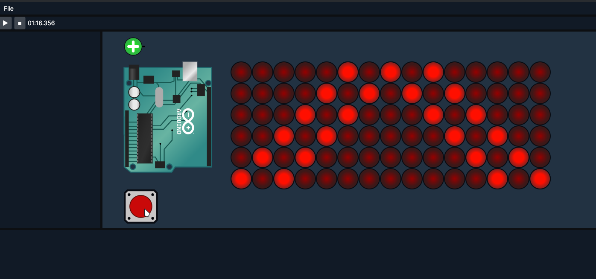

# Arguino - Arduino simulation in a virtual environment

This project is the main focus of the bachelor thesis written for the Faculty of Mathematics and Physics at Charles University in 2026.

Author: Adam Balko
Supervisor:  RNDr. David Bednárek, Ph.D.

## Introduction

Arduino is a very popular microcomputer among amateurs and professionals alike. Despite this, testing the code for an Arduino machine can be fairly difficult. Debugging options are limited and the user needs to rely on additional measuring equipment. The usual choice is to test the code with an AVR emulator. Emulation is the process of running machine code on a hardware that doesn't match its instruction set. AVR is the processor that controls the Arduino board. These emulators are sometimes part of a bigger logical circuit simulation system, other times they are just a single piece of software.

Goal of this work is to skip the emulation process and create a working Arduino simulator by mimicking the changes of digital values on the board's pinout. The user code will be compiled directly to the x86-64 architecture instruction set, which is our target platform, and thus able to run at the native speed of the host machine.

Bundled with this simulator is a graphic application for creating and testing logical circuits. This GUI is written with Avalonia framework and will contain Arduino as it's main component. The point of this application is to attach to the running Arduino simulator and visualize the expected Arduino behavior with user's code on a given circuit. We want to give the user the power to compose their own circuits, and define the behavior and looks of their components. Additionally, the user will be able to debug their program, while the GUI is running, using their preferred IDE and C++ debugger, providing real-time feedback and inspection when stepping through the code.

## Example
Using Arduino to draw chevron-like patterns



## Software prerequisites:

* **arduino-cli**
* **Minimal system requirements of Avalonia UI**
* **.NET 9 SDK or higher**
* **C++ compiler**
* **CMake**
* **C++ Boost libraries:**
    * asio
    * interprocess
    * program_options

## Usage
### Backend process

1. Run `preprocess.sh` from the repository's root directory with the sketch directory as an argument. On Windows, use the `preprocess.bat` script instead. For example:
    
    ```shell
    ./preprocess.sh tests/buttons.
    ```
    
2. Build `backend/CMakeLists.txt`. Available targets are:
    
    * **`arguino-shared-memory`**: for IPC over shared memory
    * **`arguino-tcp`**: for IPC over TCP connection
    * **`arguino`**: is an alias for the shared memory version (Default and preferred version).

3. Run[^1]
    ```shell
    <build dir>/executable/<build target>
    ```

[^1]: On Windows, the `.exe` extension is usually appended, i.e. `.../<build target>.exe`.

### Frontend process

1. Build `frontend/gui.sln`.
2. Run the `Gui` executable (`Gui.exe` on Windows) with the desired scene. For example, executing from the `frontend` directory:
    
    ```shell
    <build dir>/Gui -s ../tests/buttons.scene.yaml
    ```
    
    If you built the TCP version of the backend, be sure to add the flag `-i Tcp`.

For frontend and backend to communicate properly, it is necessary that they connect to the same IPC object. For TCP, it is the port (`-p` option for both programs), and for shared memory it is the shared memory's object name (`--shmem-name` option for both programs). These default to the same value for both of the aforementioned options, port `8888` and memory named `Arguino-ipc`.

### GUI controls

* **`Left mouse button`**: Interact with controls (e.g. buttons)
* **`Mouse wheel scroll`**: Zoom and unzoom canvas
* **`Mouse wheel press`**: Pan canvas
* **`Holding Alt key`**: Hold mode. All controls clicked on will remain in a pressed state when clicked, until the control is clicked again. For example when holding multiple buttons is required.

---

## Command-Line Arguments

Listed below are all the available command line options for the backend and frontend executables. Default values, if defined, are specified in the square brackets. Expected arguments are in the angle brackets. For arguments accepting only specific enumeration of values, all available values are listed in the angle brackets separated by a vertical bar (`|`). In square brackets is the default value used, when the option is omitted.

### Backend

* **`--log-simulator <path>`**: Path to the log file for simulator events. [`./core.log`]
* **`--log-ipc <path>`**: Path to the log file for Inter-Process Communication (IPC). [`./core_ipc.log`]
* **`-v, --verbosity <Debug | Info | Warning | Error>`**: Verbosity level of the log files. [`Info`]

### Frontend

* **`-s, --scene <path>`**: Path to the `.yaml` scene definition file. [`./scene.yaml`]
* **`-c, --components <path>`**: Path to the directory containing component definitions. [`./ComponentManager/Components`]
* **`-i, --ipc <None | Tcp | Shmem>`**: Inter-process communication technology utilized for connecting with the simulator. [`Shmem`]
* **`--log-circuit <path>`**: Path to the log file for general circuitry events. [`./frontend.log`]
* **`--log-ipc <path>`**: Path to the log file for IPC events. [`./frontend_ipc.log`]
* **`-v, --verbosity <Debug | Info | Warning | Error>`**: Verbosity level of the log files. [`Info`]

### Common for TCP usage

* **`-p, --port <int>`**: TCP port to listen to. [`8888`]

### Common for shared memory usage

* **`--shmem-name <string>`**: Name of the memory-mapped file. [`Arguino-ipc`]
* **`--shmem-size <int>`**: Size of the memory-mapped region per circular buffer, specified in pages. [`1`]
